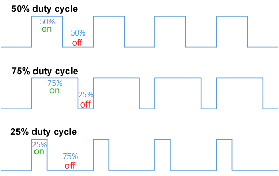

# 2526CL9_salida_PWMyMasPotencia

Salidas pseudo-analógicas PWM y como controlar mas Potencia

Indice evolutivo del las clases del taller + libros y webs de referencia:

[GitHub - Jcspoza/2526_PyR_Index: Curso Programación y Robotica 2025 2026 - CMM BML](https://github.com/Jcspoza/2526_PyR_Index)

## Clase 9 - Indice

- Propuesta de estudio : salidas pseudo-analógicas en micro Controladores => PWM + controlar mas potencia

- Materiales y links a información
  
  * Lista de materiales
  
  * Links a Tutoriales  e informacion
  - Librerías importantes - No necesarias

- Aprender / Entender: entradas analógicas en micro Controladores
  
  - Intro Teórica: DAC, el protocolo I2S y la modulación PWM
  
  - 1er montaje : Divisor de tensión
  
  - 2do Montaje : Potenciómetro
  
  - 3ro Montaje : LDR
  
  - 4to Montaje : 

- Lista (no completa) de sensores analógicos en robotica

- Proyecto completo: por decidir

- Tabla resumen de programas

- TO DO y Notas

## Propuesta de estudio : salidas pseudo-analógicas en micro Controladores => PWM + controlar mas potencia

Más que un proyecto para ir construyendo, esta Clase #9 será un estudio de como disponer de salidas pseudo-analogicas con el método de modulación del ancho del ciclo de trabajo ( PWM) dentro del rango de voltajes de la PICO 0 a 3.3 volt

## Materiales y links a información

### Materiales

| Material                                                                                                               | Descripcion                                                                                                                                                      | Kit SF |
| ---------------------------------------------------------------------------------------------------------------------- | ---------------------------------------------------------------------------------------------------------------------------------------------------------------- | ------ |
| [Protoboard 700](https://docs.sunfounder.com/projects/kepler-kit/en/latest/component/component_breadboard.html)        | Placa para prototipos ver apartado [Uso de la protoboard](https://github.com/Jcspoza/2526CL1_R_CircElect0#uso-de-la-protoboard). Mejor usar la protoboard de 700 | SI     |
| [Cables dupond M-M](https://docs.sunfounder.com/projects/kepler-kit/en/latest/component/component_wire.html)           | Sirven para hacer conexiones en protoboard                                                                                                                       | SI     |
| [Led rojo](https://docs.sunfounder.com/projects/pico-2w-kit/en/latest/component/component_led.html)                    | Se usara para indicar comienzo de cuenta de Tiempo de reacción                                                                                                   | SI     |
| [Resistencia 100 ohm x1](https://docs.sunfounder.com/projects/pico-2w-kit/en/latest/component/component_resistor.html) | Resistencia 100 ohm para limitar corriente de LED                                                                                                                | SI     |
|                                                                                                                        |                                                                                                                                                                  |        |
|                                                                                                                        |                                                                                                                                                                  |        |
|                                                                                                                        |                                                                                                                                                                  |        |
|                                                                                                                        |                                                                                                                                                                  |        |

### Links a informacion

| Tema                                | Link                                                                                                                                                                          |
| ----------------------------------- | ----------------------------------------------------------------------------------------------------------------------------------------------------------------------------- |
| I2C y DAC´s externos                | [GitHub - miketeachman/micropython-i2s-examples: Examples for I2S support on microcontrollers that run MicroPython](https://github.com/miketeachman/micropython-i2s-examples) |
| PWM                                 | [kit kepler Sunfounder 2.3 Fading LED](https://docs.sunfounder.com/projects/pico-2w-kit/en/latest/pyproject/py_fade.html)                                                     |
| Subir y bajar iluminación de un LED | https://dmccreary.github.io/learning-micropython/basics/04-fade-in-and-out/                                                                                                   |

### Librerías importantes - No son necesarias en CL9

## Aprender / Entender: salidas pseudo-analógicas en micro Controladores PWM

### Intro Teórica breve a los DAC, el protocolo I2S y la modulación PWM

El mundo real es analógico, luego si queremos controlarlo con electrónica programable (=microcontroladores), **tenemos que poder 'escribir'  señales analógicas** y viceversa ( ver clase 6 de este curso)

Por eso, no es raro que desde que aparecieron los micro Controladores, tuvieran entradas que podían convertir la informacion analógica, normalmente un valor de voltaje, en informacion digital: el controlador Arduino UNO R3 ( lanzado en 2011)  tiene 6 entradas analógicas directas, o ADC´s. 

La conversión contraria, que es la que vamos a ver en esta Clase, **desde digital a analógico** se puede hacer de 2 formas:

1) Conversión **real** de digital analógico con **DAC**´s

2) **Pseudo-conversión** de digital a analógico usando pulsos cuadrados modulados en anchura o **PWM**

o DAC no es común en los uControladores porque priorizan el bajo costo y el bajo consumo**.

--> El microcontrolador PICO _/ W /2 / 2W <u>no dispone de DAC´</u>s

--> Algunos modelos del micro controlador ESP32 disponen de 2 DAC´s pero tiene una resolución de 8 -bits, muy baja para dar una mínima calidad.

#### DAC´s y protocolo i2S

Para aplicaciones de alta fidelidad (audio, video), un DAC externo ofrece mejor rendimiento, precisión, flexibilidad y permite un diseño modular.

La comunicación de los micro-controladores con un DAC externo se realiza normalmente con un protocolo digital llamado **I2S**. Es un tema extenso y requiere comprar micrófonos y/o DAC´s i2c, asi que no lo vamos a tratar en este curso, de momento. Toda la familia PICO puede comunicarse en I2S y en micropython hay una libreria para ello, que estaá disponible y estable desde la versión de micropython 1.20

Si tienes curiosidad mira el excelente tutorial 

[GitHub - miketeachman/micropython-i2s-examples: Examples for I2S support on microcontrollers that run MicroPython](https://github.com/miketeachman/micropython-i2s-examples)

#### Modulación PWM

Como ya se ha dicho, los uControladores no permiten ajustar fácilmente una salida a **un nivel de <u>voltaje</u> determinado** sin circuitos complejos (DAC´'s) . Pero en muchas aplicaciones, **lo que en realidad necesitamos es controlar el trabajo eficaz** que va a realizar un actuador como un LED o un motor.

Trabajo eficaz =  **a energía realmente útil transferida** durante un intervalo de tiempo

En el trabajo eficaz en electricidad intervienen el voltaje, la corriente y el tiempo, luego si no podemso fijar un  voltaje o intensidad determinados, sin complicar la circuitería, si que podemos en un uC, controlar el tiempo de 'encendido' y 'apagado' de la señal que proporciona potencia, o de la señal de control para el dispositivo que entrega la potencia 

(DEL TUTORIAL DE SUNFOUNDER) **La Modulación por Ancho de Pulso (PWM)** es un método para controlar la cantidad de energía suministrada a un dispositivo electrónico mediante ciclos de encendido y apagado a alta frecuencia. El ancho del pulso (la duración de su activación) determina la cantidad de energía eficaz que recibe el dispositivo.

Pero para que toda esta 'estrategia' funcione , tenemos que hacerlo tan rápido que ni siquiera se nota el parpadeo en un LED, o tan rápido en un motor que la inercia del giro suavice los cambios. entonces, **controlar la energia eficaz** =  controlar el tiempo que una señal está activada = **controlar la anchura del pulso de activación.**

### 1er montaje : Cambiar brillo de un led por PWM

Vamos a ver como el modulación PWM cambia el brillo de un led externo. seguimos el tutorial

[Fade In and Out - Learning MicroPython](https://dmccreary.github.io/learning-micropython/basics/04-fade-in-and-out/)

[VideoDEMO de PWM](./doc/R2526_CL9_PWMdemo.mp4)

**Montamos:** un led externo conectando su ánodo (+, pata larga) al GPIO15, y su cátodo (- , pata corta, muesca en el pastico) a una resistencia de 100 ohm cuya otra pata se conecta a GND.

Un calculo sencillo indica que dado que la caída de voltaje Vf en el diodo rojo es de 1,6 volt aprox, en la resistencia han de caer 3.3 -1.6 volt= 1,7 volt, por lo que la corriente es de 1,7volt / 100 ohm = **17 mA** que es un valor alto, respecto a otros montajes con 8mA, para que el led luzca bien ( esa el la razón de una resistencia de 100 ohm y no de 220 ohm)

#### 1.A) Probamos el LED con un blink

[Rbhwt_Exblink_v1_2.py](Rbhwt_Exblink_v1_2.py)

# 

#### 1.B) Controlamos con PWM de forma precisa el brillo del led.

[R2526CL9_ExPWM_inp100_v1.py](R2526CL9_ExPWM_inp100_v1.py)

En un montaje PWM hay dos cosas que debemos decirle al microcontrolador:

1. ¿Con qué frecuencia quieres que una onda cuadrada se active y desaparezca?
2. ¿Qué tan ancha debe ser la parte activa del pulso (en relación con la anchura total)? Esto se denomina ciclo de trabajo.

La velocidad de cambio del pulso se denomina frecuencia. Se puede establecer en 1000 cambios por segundo (1K), una velocidad mucho mayor de la que el ojo humano puede detectar.

En micropython la implementación de PWM permite que el ancho del pulso se puede controlar de 2 formas :

* de forma directa indicando el ancho del pulso en nanosegundos 'duty_ns(nanosegundos)'
  * [R2526CL9_ExPWM_inNseg_v1.py](R2526CL9_ExPWM_inNseg_v1.py)
* en forma de entero sin signo con 'duty_u16(valor)' donde valor tiene un rango de 0 a 65535 (16bits)
  * [R2526CL9_ExPWM_inp100_v1.py](R2526CL9_ExPWM_inp100_v1.py)

Mira los dos programas que permiten introducir el valor dutty como nanosegundos o como porcentaje

#### 1.C) Usamos PWM para fade-in y fade out

## Proyecto completo: en inicio de pruebas : sensor humedad suelo + bomba agua (moto)

Esta lección forma parte del los aprendizajes necesarios para controlar cargas analógicas de cierta potencia como un motor

## Tabla resumen de programas

| Programa                                                   | Lenguaje | HW si Robotica y Notas                   | Objetivo de Aprendizaje |
| ---------------------------------------------------------- | -------- | ---------------------------------------- | ----------------------- |
| [Rbhwt_Exblink_v1_2.py](Rbhwt_Exblink_v1_2.py)             | uPy      | LED en GPIO15 con resistencia de 100 ohm |                         |
| [R2526CL9_ExPWM_inp100_v1.py](R2526CL9_ExPWM_inp100_v1.py) | uPy      |                                          |                         |
| [R2526CL9_ExPWM_inNseg_v1.py](R2526CL9_ExPWM_inNseg_v1.py) | uPy      |                                          |                         |
|                                                            | uPy      |                                          |                         |
|                                                            | uPy      |                                          |                         |
|                                                            | uPy      |                                          |                         |

---

## TO DO y Nota

- Todo: 
