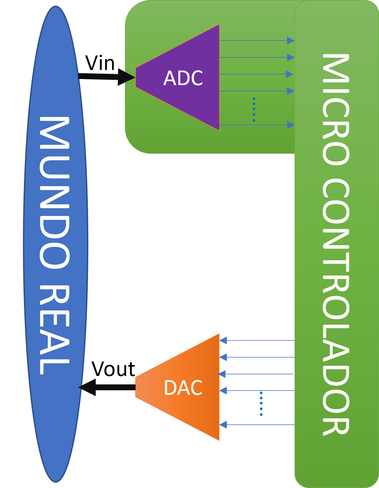
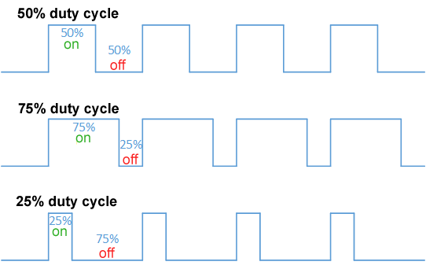
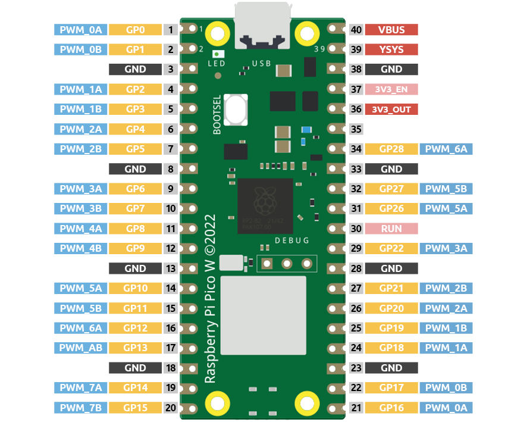
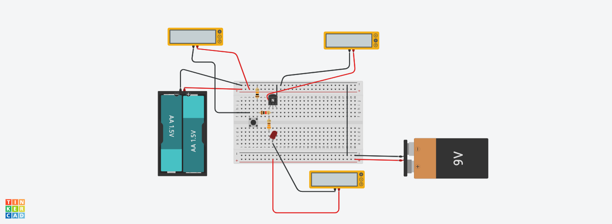

# 2526CL9_salida_PWMyMasPotencia

Salidas pseudo-analógicas PWM y como controlar mas Potencia

Indice evolutivo del las clases del taller + libros y webs de referencia:

[GitHub - Jcspoza/2526_PyR_Index: Curso Programación y Robotica 2025 2026 - CMM BML](https://github.com/Jcspoza/2526_PyR_Index)

## Clase 9 - Indice

- Propuesta de estudio : salidas pseudo-analógicas en micro Controladores => PWM + controlar mas potencia

- Materiales y links a información
  
  * Lista de materiales
  
  * Links a Tutoriales  e informacion
  - Librerías importantes - No necesarias

- Aprender / Entender: entradas analógicas en micro Controladores
  
  - Intro Teórica: DAC, el protocolo I2S y la modulación PWM
  
  - 1er montaje : Cambiar brillo de un led por PWM
  
  - 2do Montaje : Controlar LED a 9vot desde 3,3 volt con Transistor BJC (sin PICO)
  
  - 3er Montaje : Controlar LED a 9vot desde 3,3 volt con Transistor BJC (con PICO) por PWM
  
  - 4toMontaje : Controlar MOTOR a 5 volt desde 3,3 volt con Transistor BJC (con PICO) por PWM

- Tabla resumen de programas

- TO DO y Notas

## Propuesta de estudio : salidas pseudo-analógicas en micro Controladores => PWM + controlar mas potencia

Más que un proyecto para ir construyendo, esta Clase #9 será un estudio de como disponer de salidas pseudo-analogicas con el método de modulación del ancho del ciclo de trabajo ( PWM) dentro del rango de voltajes de la PICO 0 a 3.3 volt

## Materiales y links a información

### Materiales

| Material                                                                                                                   | Descripcion                                                                                                                                                      | Kit SF | Montaje       |
| -------------------------------------------------------------------------------------------------------------------------- | ---------------------------------------------------------------------------------------------------------------------------------------------------------------- | ------ | ------------- |
| [Protoboard 700](https://docs.sunfounder.com/projects/kepler-kit/en/latest/component/component_breadboard.html)            | Placa para prototipos ver apartado [Uso de la protoboard](https://github.com/Jcspoza/2526CL1_R_CircElect0#uso-de-la-protoboard). Mejor usar la protoboard de 700 | SI     | Todos         |
| [Cables dupond M-M](https://docs.sunfounder.com/projects/kepler-kit/en/latest/component/component_wire.html)               | Sirven para hacer conexiones en protoboard                                                                                                                       | SI     | Todos         |
| [Led rojo](https://docs.sunfounder.com/projects/pico-2w-kit/en/latest/component/component_led.html)                        | Se usara para indicar comienzo de cuenta de Tiempo de reacción                                                                                                   | SI     | Mon.  #1      |
| [Resistencia 100 ohm x1](https://docs.sunfounder.com/projects/pico-2w-kit/en/latest/component/component_resistor.html)     | Resistencia 100 ohm para limitar corriente de LED                                                                                                                | SI     | Mon. #1       |
| Pico _, 2, W, 2W                                                                                                           | Vale cualquiera de los 4 modelos de Pico                                                                                                                         | SI     | Mon. #1       |
| [Transistor BJC NPN S8050](https://docs.sunfounder.com/projects/pico-2w-kit/en/latest/component/component_transistor.html) |                                                                                                                                                                  | SI     | Mon#2, #3, #4 |

### Links a informacion

| Tema                                | Link                                                                                                                                                                          |
| ----------------------------------- | ----------------------------------------------------------------------------------------------------------------------------------------------------------------------------- |
| I2C y DAC´s externos                | [GitHub - miketeachman/micropython-i2s-examples: Examples for I2S support on microcontrollers that run MicroPython](https://github.com/miketeachman/micropython-i2s-examples) |
| PWM                                 | [kit kepler Sunfounder 2.3 Fading LED](https://docs.sunfounder.com/projects/pico-2w-kit/en/latest/pyproject/py_fade.html)                                                     |
| Subir y bajar iluminación de un LED | https://dmccreary.github.io/learning-micropython/basics/04-fade-in-and-out/                                                                                                   |

### Librerías importantes - No son necesarias en CL9

## Aprender / Entender: salidas pseudo-analógicas en micro Controladores PWM

### Intro Teórica breve a los DAC, el protocolo I2S y la modulación PWM

El mundo real es analógico, luego si queremos controlarlo con electrónica programable (=microcontroladores), **tenemos que poder 'escribir'  señales analógicas** y viceversa ( ver clase 6 de este curso)

Por eso, no es raro que desde que aparecieron los micro Controladores, tuvieran entradas que podían convertir la informacion analógica, normalmente un valor de voltaje, en informacion digital: el controlador Arduino UNO R3 ( lanzado en 2011)  tiene 6 entradas analógicas directas, o ADC´s. 

La conversión contraria, que es la que vamos a ver en esta Clase, **desde digital a analógico** se puede hacer de 2 formas:

1) Conversión **real** de digital analógico con **DAC**´s

2) **Pseudo-conversión** de digital a analógico usando pulsos cuadrados modulados en anchura o **PWM**

o DAC no es común en los uControladores porque priorizan el bajo costo y el bajo consumo**.

--> El microcontrolador PICO _/ W /2 / 2W <u>no dispone de DAC´</u>s

--> Algunos modelos del micro controlador ESP32 disponen de 2 DAC´s pero tiene una resolución de 8 -bits, muy baja para dar una mínima calidad.

#### DAC´s y protocolo i2S

Para aplicaciones de alta fidelidad (audio, video), un DAC externo ofrece mejor rendimiento, precisión, flexibilidad y permite un diseño modular.

La comunicación de los micro-controladores con un DAC externo se realiza normalmente con un protocolo digital llamado **I2S**. Es un tema extenso y requiere comprar micrófonos y/o DAC´s i2c, asi que no lo vamos a tratar en este curso, de momento. Toda la familia PICO puede comunicarse en I2S y en micropython hay una libreria para ello, que estaá disponible y estable desde la versión de micropython 1.20

Si tienes curiosidad mira el excelente tutorial 

[GitHub - miketeachman/micropython-i2s-examples: Examples for I2S support on microcontrollers that run MicroPython](https://github.com/miketeachman/micropython-i2s-examples)

#### Modulación PWM

Como ya se ha dicho, los uControladores no permiten ajustar fácilmente una salida a **un nivel de <u>voltaje</u> determinado** sin circuitos complejos (DAC´'s) . Pero en muchas aplicaciones, **lo que en realidad necesitamos es controlar el trabajo eficaz** que va a realizar un actuador como un LED o un motor.

Trabajo eficaz =  **a energía realmente útil transferida** durante un intervalo de tiempo

En el trabajo eficaz en electricidad intervienen el voltaje, la corriente y el tiempo, luego si no podemso fijar un  voltaje o intensidad determinados, sin complicar la circuitería, si que podemos en un uC, controlar el tiempo de 'encendido' y 'apagado' de la señal que proporciona potencia, o de la señal de control para el dispositivo que entrega la potencia 

(DEL TUTORIAL DE SUNFOUNDER) **La Modulación por Ancho de Pulso (PWM)** es un método para controlar la cantidad de energía suministrada a un dispositivo electrónico mediante ciclos de encendido y apagado a alta frecuencia. El ancho del pulso (la duración de su activación) determina la cantidad de energía eficaz que recibe el dispositivo.

Pero para que toda esta 'estrategia' funcione , tenemos que hacerlo tan rápido que ni siquiera se nota el parpadeo en un LED, o tan rápido en un motor que la inercia del giro suavice los cambios. entonces, **controlar la energia eficaz** =  controlar el tiempo que una señal está activada = **controlar la anchura del pulso de activación.**

#### Capacidades de PWM de la Pico y Pico 2

Aunque el nuevo chip de la PICO 2 el RP2350 tiene 12 canales dobles de PWM, en la tarjeta PICO 2 y PICO 2W **solo 'salen' 8**de ellos en los mismos pines que en el PICO y PICO W.

Cada canal, por ejemplo PWM_0_ se puede configurar en una frecuencia de trabajo y 2 duty cycles en cada una de sus salidas A y B. 

El dibujo de abajo indica las limitaciones de configuración, por ejemplo: el GPIO16 y el GPIO0 tiene en mismo canal y lado (PWM_0A) en cuanto a PWM por la que sus salidas no pueden configurarse de forma independiente

- **Frecuencia:** Los canales dentro de la misma sección comparten la misma frecuencia, pero pueden tener ciclos de trabajo controlados individualmente. La frecuencia puede variar desde tan solo **8 Hz hasta un máximo de 62,5 MHz**cuando el microcontrolador funciona a su velocidad de reloj predeterminada de 125 MHz.
- **Resolución:** Los canales PWM tienen una **resolución de 16 bits** , lo que permite un control muy fino sobre el ciclo de trabajo, utilizando valores de 0 a 65,535 para representar del 0% al 100% del ciclo de trabajo.

Aplicaciones típicas:

- **Control de brillo del LED:** ajuste del brillo de los LED estándar o RGB variando el ciclo de trabajo.
- **Control de motor:** control preciso de la velocidad de los motores de CC o el ángulo de los servomotores.
- **Generación de audio:** creación de tonos de audio simples mediante la generación de frecuencias específicas.
- **Simulación de voltaje:** simulación de una salida de voltaje analógica (entre 0 V y 3,3 V) activando y desactivando rápidamente un pin digital.

- ### 1er montaje : Cambiar brillo de un led por PWM

Vamos a ver como el modulación PWM cambia el brillo de un led externo. seguimos el tutorial

[Fade In and Out - Learning MicroPython](https://dmccreary.github.io/learning-micropython/basics/04-fade-in-and-out/)

**Montamos:** un led externo conectando su ánodo (+, pata larga) al GPIO15, y su cátodo (- , pata corta, muesca en el pastico) a una resistencia de 100 ohm cuya otra pata se conecta a GND.

Un calculo sencillo indica que dado que la caída de voltaje Vf en el diodo rojo es de 1,6 volt aprox, en la resistencia han de caer 3.3 -1.6 volt= 1,7 volt, por lo que la corriente es de 1,7volt / 100 ohm = **17 mA** que es un valor alto, respecto a otros montajes con 8mA, para que el led luzca bien ( esa el la razón de una resistencia de 100 ohm y no de 220 ohm)

#### 1.A) Probamos el LED con un blink

[Rbhwt_Exblink_v1_2.py](Rbhwt_Exblink_v1_2.py)

#### 1.B) Controlamos con PWM de forma precisa el brillo del led.

[R2526CL9_ExPWM_inp100_v1.py](R2526CL9_ExPWM_inp100_v1.py)

En un montaje PWM hay dos cosas que debemos decirle al microcontrolador:

1. ¿Con qué frecuencia quieres que una onda cuadrada se active y desaparezca?
2. ¿Qué tan ancha debe ser la parte activa del pulso (en relación con la anchura total)? Esto se denomina ciclo de trabajo.

La velocidad de cambio del pulso se denomina frecuencia. Se puede establecer en 1000 cambios por segundo (1K), una velocidad mucho mayor de la que el ojo humano puede detectar.

En micropython la implementación de PWM permite que el ancho del pulso se puede controlar de 2 formas :

* de forma directa indicando el ancho del pulso en nanosegundos 'duty_ns(nanosegundos)'
  * [R2526CL9_ExPWM_inNseg_v1.py](R2526CL9_ExPWM_inNseg_v1.py)
* en forma de entero sin signo con 'duty_u16(valor)' donde valor tiene un rango de 0 a 65535 (16bits)
  * [R2526CL9_ExPWM_inp100_v1.py](R2526CL9_ExPWM_inp100_v1.py)

Mira los dos programas que permiten introducir el valor dutty como nanosegundos o como porcentaje

**SUGERENCIA: Usa un osciloscopio si dispones de él para ver la onda cuadrada generada**

[TikTok  Video demo de PWM](https://www.tiktok.com/@jcspoza/video/7609828774716230934?is_from_webapp=1&sender_device=pc&web_id=7532116150106031638)

#### 1.C) Usamos PWM para fade-in y fade out

Y por fin el programa completo que va subiendo y bajando el ciclo de trabajo

[R2526CL9_ExPWM_cycleFiFo_v1.py](R2526CL9_ExPWM_cycleFiFo_v1.py)

## 2do Montaje : Controlar LED a 9vot desde 3,3 volt con Transistor BJC (sin PICO)

### Tutoriales y Objetivo

#### Tutoriales

Hay muchísima informacion y tutoriales sobre transistores 'clásicos' ( BJC) . Lo mas sencillo para empezar el es libro del que ya hemos hablado y que esta disponible en

[Electronica para makers - Paoplo Aliverti - Ed marcombo](https://github.com/Jcspoza/2526_PyR_Index/blob/main/doc/edoc.site_electronica-para-makers-paolo-aliverti.pdf)

Consultad desde la pagina 164 en adelante y en especial para este montaje y el siguiente el apartado **Transistor en saturación** ( que deberia llamarse en corte-saturacion o en modo interruptor)

En el libro se habla del transistor 2N2222  (modelo NPN) , pero  el transistor que tenéis en el kit para NPN es el S8050 : son prácticamente idénticos.

[Transistor &mdash; SunFounder Pico 2 W Starter Kit for Raspberry Pi Pico 2 W documentation](https://docs.sunfounder.com/projects/pico-2w-kit/en/latest/component/component_transistor.html)

Un tutorial muy detallado del transistor S8050 es 

[Guía de transistores NPN S8050: Pinado, Clasificaciones, Aplicaciones y Polarización](https://www.digi-electronics.es/sp/blogs/s8050-npn-transistor-guide-pinout-ratings-applications-biasing/271.html)

**El MEJOR tutorial que he visto es** [Bipolar Transistor Tutorial, The BJT Transistor](https://www.electronics-tutorials.ws/transistor/tran_1.html)

muy detallado dividido en 12 tutoriales,  en ingles.

#### Objetivo

Ya hemos visto como hacer variar el voltaje con el truco del PWM , pero solo nos vale para variaciones de 0 a 3,3 volt, y por otro lado un pin GPIO no puede ( no debe pedírsele)  mas de unos 20 mA, es decir que tenemos unos 60 mW, que no es mucho. 

**Cuando necesitemos manejar mas potencia** **no podemos usar la PICO como fuente de energia, pero si como controlador de la energia que va a dar una fuente independiente.** La primera opcion es :

1. Usar una fuente de alimentación adicional conectando las tierras en común

2. usar el PWM hasta 3,3 volt para controlar un interruptor rápido como es un transistor, que eleve el voltaje o la corriente de potencia

Eso es exactamente lo que hace un transistor en modo emisor común ( el modo colector común también vale)  configurado para estar solo en corte o saturación

### Montaje

No vamos a usar en el montaje una PICO porque interesa cacharrear a gusto y hacer medias 

#### Montaje 'ejecutable'

**Por primera vez uso un simulador de circuitos en este curso**: para dibujar el montaje y para dar el listado de componentes, esta bien, aunque el esquemático no me gusta como queda. El simulador es ejecutable y se supone que se pueden colocar amperímetros y voltímetros. Yo os rogaria que hicierais el montaje con hardware de verdad, porque aunque los simuladores estan bien, nada sustituye la realidad 

[Circuit design Transistor cambia 3_a_9volt - Tinkercad](https://www.tinkercad.com/things/6eDDJTdeRIM-transistor-cambia-3a9volt?sharecode=ejcMYhQ0xF4YVPdFykIIm5n5ran323GCxTJmA1b2t1g)

(espero haber dado ok los permisos)

O usa este con medidores

[Transistor cambia 2 a 9 volt y medidores](https://www.tinkercad.com/things/2mT4O7ipjph-transistor-cambia-3a9volt-y-medidores)

#### Montaje vista real, lista de componente y esquemático

[Esquemático Transitor cambia 3 volt a 9 volt en pdf](./doc/Transistor_cambia_a_9volt.pdf)

| Nombre                                               | Cantidad | Componente                       |
| ---------------------------------------------------- | -------- | -------------------------------- |
| BAT1                                                 | 1        | Pila de 9 V                      |
| T2N2222                                              | 1        | Transistor NPN (BJT)             |
| RRled                                                | 1        | 330 Ω Resistencia                |
| D1                                                   | 1        | Rojo LED                         |
| RRbase                                               | 1        | 1 kΩ Resistencia                 |
| RR pull down base                                    | 1        | 10 kΩ Resistencia                |
| S1                                                   | 1        | Pulsador                         |
| Bat2                                                 | 1        | 2 baterías, AA, no Pila de 1,5 V |
| MeterCorriente de Colector MeterCorriente de base | 2        | Amperaje Multímetro              |
| MeterVce                                             | 1        | Voltaje Multímetro               |

## Proyecto completo-> en inicio de pruebas : sensor humedad suelo + bomba agua (motor)

Esta lección forma parte del los aprendizajes necesarios para controlar cargas analógicas de cierta potencia como un motor

## Tabla resumen de programas

| Programa                                                         | Lenguaje | HW si Robotica y Notas                   | Objetivo de Aprendizaje                                                                                 |
| ---------------------------------------------------------------- | -------- | ---------------------------------------- | ------------------------------------------------------------------------------------------------------- |
| [Rbhwt_Exblink_v1_2.py](Rbhwt_Exblink_v1_2.py)                   | uPy      | LED en GPIO16 con resistencia de 100 ohm | Prueba de led externo                                                                                   |
| [R2526CL9_ExPWM_inp100_v1.py](R2526CL9_ExPWM_inp100_v1.py)       | uPy      | LED en GPIO16 con resistencia de 100 ohm | Se puede introducir el duty en % de 0 a 100, para la onda cuadrada PWM - Sale try-except                |
| [R2526CL9_ExPWM_inNseg_v1.py](R2526CL9_ExPWM_inNseg_v1.py)       | uPy      | LED en GPIO16 con resistencia de 100 ohm | Se puede introducir el duty en nanosegundos de 0 a 100, para la onda cuadrada PWM - Sale con try-except |
| [R2526CL9_ExPWM_cycleFiFo_v1.py](R2526CL9_ExPWM_cycleFiFo_v1.py) | uPy      | LED en GPIO16 con resistencia de 100 ohm | Cicla la luminoisdad del un led - Sale con try-except                                                   |
|                                                                  | uPy      |                                          |                                                                                                         |
|                                                                  | uPy      |                                          |                                                                                                         |

---

## TO DO y Nota

- ##### Todo
